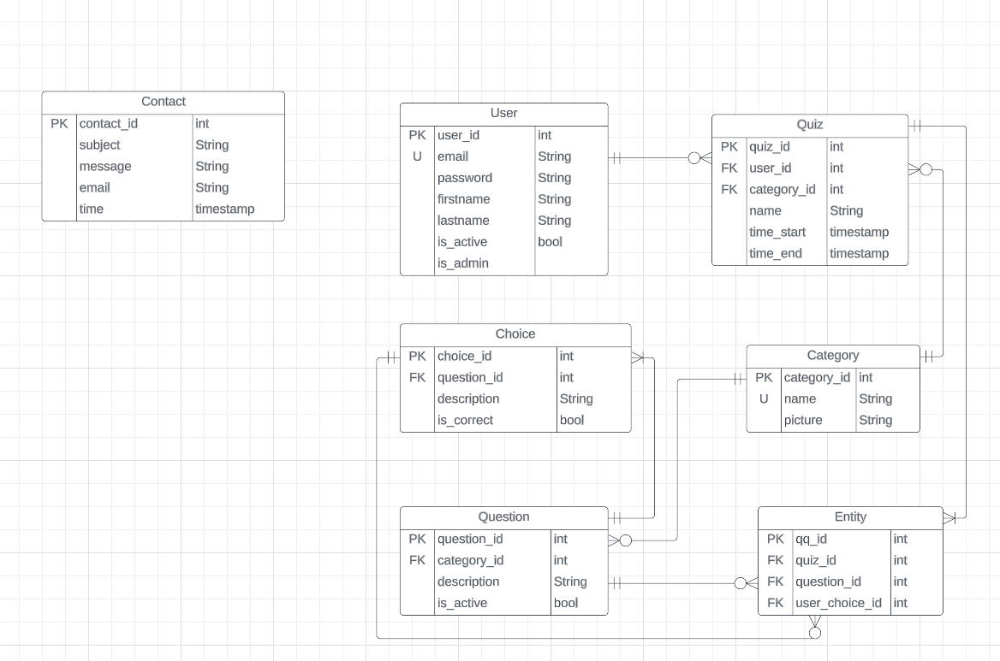

# Quiz Demo

# Database Design

# Where is the databse initialization file
1. ./src/main/resources/static/initialization.sql
2. ./src/main/resources/static/addData.sql
3. I also provide a database dump you can find it in the "database_dump" folder(Please use this to generate the db)

# Basic requirement
All has been done

# Optional requirements

# Bonus requirements
1. In the event that the admin changes the correct answer for a question, the corresponding quiz results will also be updated accordingly

# Some Assumption
1. User's email cannot be updated
2. Category name should be unique and not null
3. Question choice cannot have empty description
4. When we are modifying question, we cannot add additional choice and change the category
